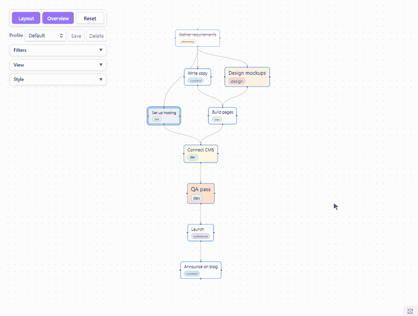
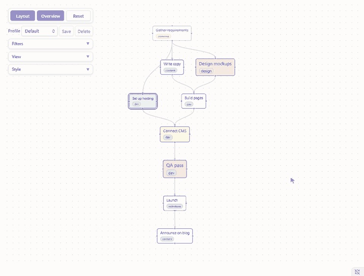

# Tasks Flowchart

[](https://community.obsidian.md/plugins/task-flow)
[](https://community.obsidian.md/plugins/task-flow)
[](https://github.com/shenfan19/task-flow/releases/latest)
[](https://github.com/shenfan19/task-flow/blob/main/manifest.json)
[](https://github.com/shenfan19/task-flow/blob/main/LICENSE)

**Tasks Flowchart** is a plugin for [Obsidian](https://obsidian.md) that draws your [Tasks](https://github.com/obsidian-tasks-group/obsidian-tasks) as a flowchart. Follow the flow of work along dependency chains, spot the tasks holding others up, and link or create tasks by dragging. Every link is saved as a field on the task line in your note.

[中文说明](https://github.com/shenfan19/task-flow/blob/main/README_zh.md)

[Watch the four minute walkthrough on YouTube](https://www.youtube.com/watch?v=bcdKUnvzx1I)

**Drag onto another task to link them. Drag onto empty canvas to create a task, downstream if you start from the bottom and upstream if you start from the top.**


**Layout puts every task in order, and the date axis stretches the flow along real dates.**



**Group tasks by tag, note or priority into lanes.**



## Why Tasks Flowchart

- **Your plan lives in your notes.** Every node is a task line in your notes and every arrow is a field on that line. There is no database and no hidden file format, so the plan works in any editor, with git and sync, with Dataview and the Tasks plugin's own queries, and it is all still there if you uninstall Tasks Flowchart.
- **See which tasks hold others up.** Upstream tasks come before the tasks that wait on them, and a task with nothing left above it is one you can start now.

Three lines like these become three connected nodes:

```markdown
- [ ] Write copy  [id:: copy]
- [ ] Design mockups  [id:: design]
- [ ] Build pages  [dependsOn:: design,copy]
```

## Getting started

1. Install and enable the [Tasks](https://github.com/obsidian-tasks-group/obsidian-tasks) plugin. Tasks Flowchart reads ids and dependencies in either of its formats, the emoji format `🆔` and `⛔` or the Dataview format `[id:: ]` and `[dependsOn:: ]`, and writes the one you pick under **Task format** in **Style**.
2. Install Tasks Flowchart from **Settings → Community plugins → Browse**. To install manually, copy `main.js`, `manifest.json` and `styles.css` from the [latest release](https://github.com/shenfan19/task-flow/releases/latest) into `<your-vault>/.obsidian/plugins/task-flow/`.
3. Click **Open tasks flowchart** in the left ribbon, or run **Tasks Flowchart: Open flowchart**. Click **Layout** at the top left, then **Overview**.
4. New to linking tasks? Click **Create sample note** on the empty canvas, or run **Tasks Flowchart: Create sample note**, for a small linked plan to try things on.

At the top left of the view are the **Layout**, **Overview** and **Reset** buttons and, below them, the **Profile** row. The other settings live in the folded cards under them, **View**, **Filters** and **Style**; click a card's title to open it.

## What you can do

Each item links to its page in the [manual](docs/index.md).

- **Link and create**: drag between tasks to link them, onto empty canvas to add a linked task. See [Links and new tasks](docs/links.md).
- **Edit in place**: double-click a task to change its name, dates, priority and tags without leaving the graph. See [Editing tasks](docs/editing.md).
- **Highlight and focus**: mark the tasks that matter, or fade everything but one task's whole chain. See [Highlight and focus](docs/highlight_focus.md).
- **Arrange**: one click of Layout orders the graph, the date axis places tasks by date, and Separate links keeps overlapping links apart. See [Arranging the graph](docs/arranging.md) and [How Layout arranges nodes](docs/layout_stability.md).
- **Lanes**: group tasks by tag, note or priority. See [Lanes](docs/lanes.md).
- **Filters, profiles and style**: hide what you do not need, save a setup as a profile, and size and color the nodes. See [Filters, profiles and style](docs/filters_profiles_style.md).

## Troubleshooting

A task missing from the graph usually has no dependency link, and **Only show tasks with a relation** hides such tasks by default. Otherwise check the keyword, status, tag, priority and folder filters, and check that the Tasks plugin indexes the line, which requires the Tasks global filter tag if you set one.

Tasks Flowchart reads ids, dependencies and dates in both formats anywhere on the line, so links survive text that archiving plugins append after them. The Tasks plugin only reads fields at the end of a line, and only in the format it is set to, so its own queries see no id, dependencies or dates on such a task, or on a line that mixes the two formats.

## Feedback

Found a bug or have an idea? Please [open an issue on GitHub](https://github.com/shenfan19/task-flow/issues). For a bug, include your Obsidian and Tasks versions and a few task lines that show the problem. Keywords in Filters search the task text and tags only, not fields such as `[id:: ]` or dates. If you need to filter by those, open an issue and describe what you are trying to do.

## Data

Dependencies live only in your notes. Node positions, the pan and zoom of the canvas, filters, profiles, view settings, highlights and focus are saved in `.obsidian/plugins/task-flow/data.json`. Deleting that file resets the layout and settings without touching any task.

## Your notes

Tasks Flowchart edits your notes directly. Linking two tasks adds an id field to one task line and a dependency field to the other, `🆔` and `⛔` or `[id:: ]` and `[dependsOn:: ]` depending on **Task format**, unlinking removes that entry from the dependency list, and dropping a connection on empty canvas inserts a new `- [ ] untitled` line below the task it started from. It changes only the task lines involved and leaves the rest of the note as it is. There is no undo inside the flowchart: Obsidian's own undo works while the note is open in an editor, and the core File recovery plugin keeps snapshots you can go back to. Keep your vault backed up or under version control, such as git or Obsidian Sync version history, before using it on notes that matter.

The plugin is provided as is, without warranty of any kind, as set out in the [MIT license](https://github.com/shenfan19/task-flow/blob/main/LICENSE).

## Development

The project requires Node.js 22 or later. `npm install` and `npm run build` write `main.js`, `manifest.json` and `styles.css` to `dist/`. Releases are built and published by GitHub Actions from a version tag, and the steps are described at the top of `.github/workflows/release.yml`.

## Acknowledgments

This project was developed with AI coding assistance for code generation, automated testing, and documentation.

## License

MIT, see [LICENSE](https://github.com/shenfan19/task-flow/blob/main/LICENSE).
