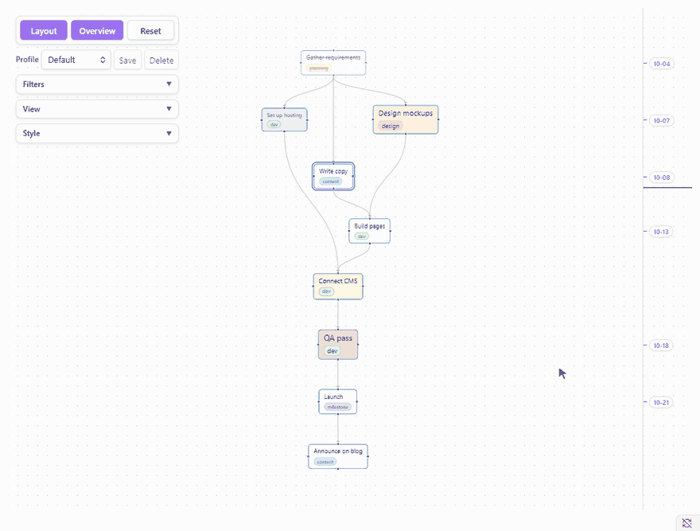
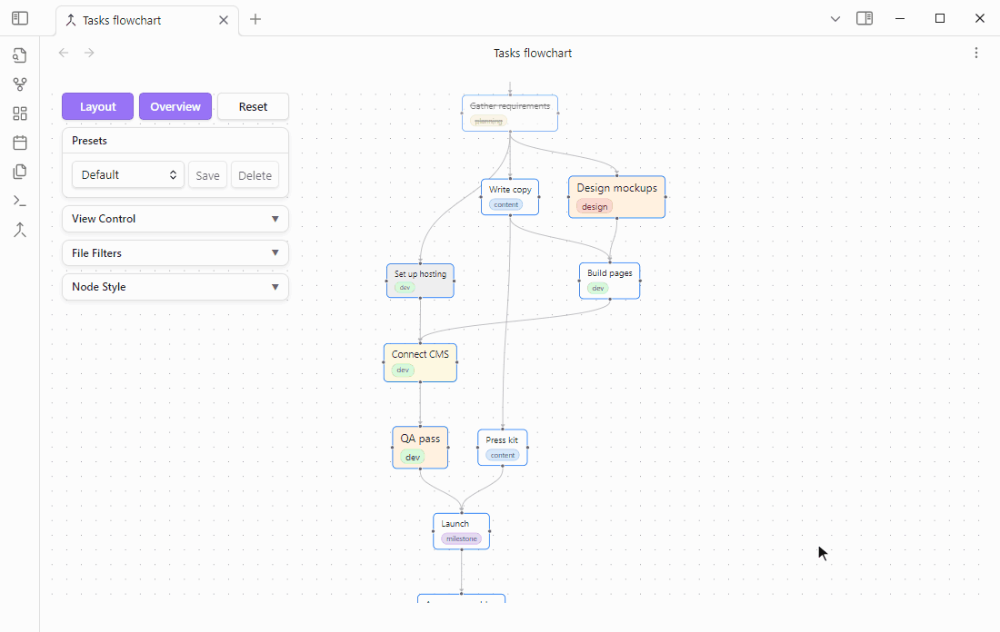
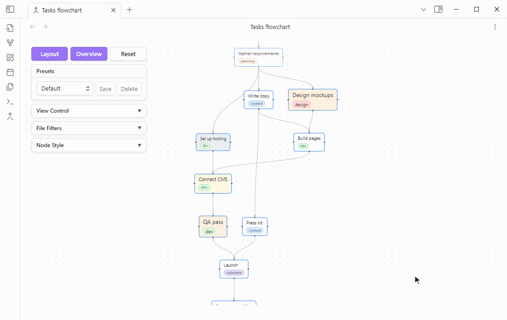

# Tasks Flowchart

[](https://community.obsidian.md/plugins/task-flow)
[](https://community.obsidian.md/plugins/task-flow)
[](https://github.com/shenfan19/task-flow/releases/latest)
[](https://github.com/shenfan19/task-flow/blob/main/manifest.json)
[](https://github.com/shenfan19/task-flow/blob/main/LICENSE)

**Tasks Flowchart** is a plugin for [Obsidian](https://obsidian.md) that draws your [Tasks](https://github.com/obsidian-tasks-group/obsidian-tasks) as a flowchart. Follow the flow of work along dependency chains, spot the tasks holding others up, and link or create tasks by dragging. Every link is saved as a field on the task line in your note.

[中文说明](https://github.com/shenfan19/task-flow/blob/main/README_zh.md)

**Double-click a task to edit it, then Layout places it on the date axis by its new date.**



**Drag onto another task to link them, or onto empty canvas to create a linked task. Right-click an arrow to delete it.**



**Focus a task's whole chain, and highlight the tasks and arrows that matter.**



## Why Tasks Flowchart

- **Your plan lives in your notes.** Every node is a task line in your notes and every arrow is a field on that line. There is no database and no hidden file format, so the plan works in any editor, with git and sync, with Dataview and the Tasks plugin's own queries, and it is all still there if you uninstall Tasks Flowchart.
- **See which tasks hold others up.** Upstream tasks come before the tasks that wait on them, and a task with nothing left above it is one you can start now.

Three lines like these become three connected nodes:

```markdown
- [ ] Write copy  [id:: copy]
- [ ] Design mockups  [id:: design]
- [ ] Build pages  [dependsOn:: design,copy]
```

## Getting started

1. Install and enable the [Tasks](https://github.com/obsidian-tasks-group/obsidian-tasks) plugin. Tasks Flowchart reads its Dataview-style fields `[id:: ]` and `[dependsOn:: ]`. The emoji format `🆔` and `⛔` is not supported yet.
2. Install Tasks Flowchart from **Settings → Community plugins → Browse**. To install manually, copy `main.js`, `manifest.json` and `styles.css` from the [latest release](https://github.com/shenfan19/task-flow/releases/latest) into `<your-vault>/.obsidian/plugins/task-flow/`.
3. Click **Open tasks flowchart** in the left ribbon, or run **Tasks Flowchart: Open flowchart**. Click **Layout** at the top left, then **Overview**.
4. New to linking tasks? Click **Create sample note** on the empty canvas, or run **Tasks Flowchart: Create sample note**, for a small linked plan to try things on.

At the top left of the view are the **Layout**, **Overview** and **Reset** buttons and, below them, the **Profile** row. The other settings live in the folded cards under them, **View**, **Filters** and **Style**; click a card's title to open it.

## Usage

- **Link**: drag from a node's downstream side, the bottom in a top to bottom layout, or from its left or right side onto another node. That node now depends on the first one. Drag from the upstream side instead to make the first node depend on the other. A missing `[id:: ]` is generated for you.
- **Unlink**: right-click an arrow and choose **Delete link**, or click it and press Delete or Backspace.
- **Create**: let go on empty canvas instead of on a node. A line `- [ ] untitled` is added below the original task and its subtasks, linked by the same rule, and opened in the Tasks edit dialog to fill in. Set **New task** in View to **Open note** to open it in a side pane instead, with `untitled` selected so you can type the name right away. Further ones are numbered `untitled2`, `untitled3` and so on, one word each so a double-click selects the whole name, and the Tasks plugin's global filter tag is added if you use one.
- **Select**: click a node or an arrow to select it. Clicking empty canvas deselects. Hold Shift and drag on empty canvas to select every node in a box, or hold Ctrl, Cmd on a Mac, and click to add nodes one by one. Selected nodes are dragged together. Dragging on empty canvas without Shift moves the view.
- **Highlight**: right-click a node or an arrow and choose **Highlight** to mark it with a glowing outline, and **Remove highlight** to take the mark off. A highlighted node lights up alone, without its arrows. Marks stay while you click, drag and open tasks, and **Clear all highlights**, in the right-click menus including the one on empty canvas, removes them all. The color is **Highlight** in Style.
- **Focus**: right-click a node and choose **Focus chain** to keep its whole chain, every task it depends on and every task that depends on it, at full strength while the rest of the graph fades. With several nodes selected, the chains of all of them are kept together. Click empty canvas to clear the focus.
- **Reset**: the **Reset** button, or the **Tasks Flowchart: Reset, clear highlights and focus** command, removes every highlight and the focus at once and changes nothing else. Node positions stay until the next **Layout**, the pan and zoom of the canvas stay until **Overview** or until you move the canvas, and the profile, with its filters, View and Style, is not touched. Without Reset, highlights and focus are kept when the view is closed and opened again, as are the node positions and the pan and zoom.
- **Edit**: double-click a node, or right-click it and choose **Edit task…**, to edit the task in the Tasks plugin's own dialog: its name and tags, priority, dates, status, recurrence and dependencies. This needs Tasks 7.21.0 or later. Click outside the dialog to close it without saving, or use the **X** at its top right, which Tasks Flowchart adds beside the Tasks settings gear when Obsidian shows no close button there.
- **Change id**: right-click a node and choose **Change id…** to give the task a new id. Every task that depends on it is updated to the new id as well, the way renaming a note updates the links to it.
- **Tags**: right-click a node and choose **Add tag** to pick one of the tags already used in your notes, or **New tag…** at the bottom of that list to type a new one. **Remove tag** lists the task's own tags. The tag is written to or removed from the task's line in its note. Right-click a tag in the filter panel and choose **Remove … from all tasks** to take it off every task of the view, after a confirmation that says how many tasks and notes it touches.
- **Several nodes at once**: shift-drag a box around nodes, or select several, then right-click the box or one of the selected nodes. **Highlight**, **Focus chain**, **Add tag**, **Remove tag** and **Priority** then apply to all of them. **Open note**, **Edit task…** and **Change id…** are only in the menu of a single node.
- **Priority**: right-click a node and choose **Priority** to pick Highest, High, Medium, Low or Lowest, with None apart at the end. The line is changed in the format it already uses, `[priority:: high]` or the emoji, and a task without a priority gets the `[priority:: …]` field.
- **Open**: right-click a node and choose **Open note**, or set a click to open, to open its note in a side pane with the cursor at the end of the task's name, ready to type. A name still left as `untitled` is selected instead, so typing replaces it. **Click** and **Double-click** in View set what each does to a node, **Select**, **Focus chain**, **Open note** or **Edit task**. By default a click selects and a double click edits. Right-click an arrow to open the note at either end.
- **Commands**: **Tasks Flowchart: Layout** and **Tasks Flowchart: Overview, fit the graph in the view** do the same as the two buttons and can be given hotkeys in **Settings → Hotkeys**.
- **Zoom out**: the canvas zooms out to 2% so that a large graph fits on screen. Below 30% the task text and tags are hidden and only each node's size and color remain.
- **Arrange**: drag nodes freely, and their positions are remembered. **Layout** arranges everything in the chosen direction with curved, straight or stepped arrows and keeps the zoom. The view stays where it is, or centers on the selected task if there is one. **Overview** fits the graph on screen. Both buttons sit at the top of the rail on the left.
- **Date axis**: on by default, and turned off in View. Each task is placed by one date: the done date of a finished task, otherwise its due date, then its scheduled date, then its start date. Tasks sharing a date line up, undated tasks fall between their neighbors, and the ruler marks each task's date and stretches with the tasks in between. A red line marks today, a red arrow marks a task dated before one it depends on, and dated nodes can only be dragged sideways.
- **Tag lanes**: in View, choose how nodes are grouped across the flow direction, so tasks with the same tag sit in one column, or one row in a left to right layout. It is **Default**, no lanes, until you pick another. Each lane is a tinted band in the color of its tag, with the tag's name along the edge of the view. Lanes only move nodes across the flow, so the date axis and every node's place along it stay as they were. Tasks that overlap along the flow in one lane are put side by side inside it, and the lane widens to fit. A task belongs to one lane, so **Lane tag** chooses which of its tags decides: **Most common tag**, the one most tasks share, **Rarest tag**, or **First tag** on the task line. Tasks without a tag go in the last lane. The modes are:
  - **Lanes, auto order**: one lane per tag, ordered by where the tag's tasks already were and then adjusted so that lanes with many links between them are neighbors.
  - **Lanes, A-Z**: lanes in alphabetical order, which never changes when the graph does.
  - **Lanes, biggest first**: the tag with the most tasks first.
  - **Soft pull to tag**: tasks are only drawn toward the center of their tag instead of being forced into columns, so the shape of the usual layout still shows. Bands follow the tasks and may touch.
  
  Lanes are applied at **Layout**, like every other arrangement, and dragging a node by hand is still possible afterwards. With many tags, each tag becomes a lane and the graph gets wide; filter some tags out first, or use **Soft pull to tag**.
- **Filter**: in **Filters**, show only tasks with a dependency link, which is on by default, filter by keywords such as `archived on`, by tag, priority or folder, and by status. Keywords are separated by commas and matched in the task text and tags, in any case, but not in fields such as `[id:: ]` or `[dependsOn:: ]`. Tags, priority and folders work the same way: tick the ones you want, then choose **Include** to show only those tasks or **Exclude** to hide them. With **Include** and keywords, a task is shown if its text or tags contain any of them. **Status** and **Only show tasks with a relation** are at the end of the panel. Filters are kept between sessions.
- **Profiles**: a profile keeps the Filters, View and Style together. Pick one in the **Profile** row to switch all three at once. **Save** stores the current settings in the selected profile, and **New…** saves them as a new one. A `*` after the name means the settings changed since the last save. **Default** is always there and cannot be deleted. Switching to a profile with another layout direction, link type, date axis or tag lane setting lays the graph out again. Node positions, the pan and zoom, highlights and focus belong to the view, not to a profile, so all profiles share them.
- **Style**: in **Style**, set the border, highlight and text colors and the font size and background of every node, give tasks of each priority from Highest to Lowest their own font size and background, drag **Line width** and **Arrow size** to size the links, render task text as Markdown, show tags as chips with automatic colors, and turn on **Show link counts**. With it on, each node shows `depend N`, the number of tasks it depends on, where its arrows come in, and `next N`, the number of tasks that depend on it, where they go out. Every link is counted, whether or not the filters show the task at its other end. It is off by default.
- **Refresh**: the graph follows your edits. A few seconds after you change a task line and the note is saved, its node shows the new text in the same place. A changed date moves the node on the date axis at the next **Layout**. Tasks also reload every 30 seconds, or with **Refresh** in **View**, and refreshing waits while you drag.

## Troubleshooting

A task missing from the graph usually has no dependency link, and **Only show tasks with a relation** hides such tasks by default. Otherwise check the keyword, status, tag, priority and folder filters, and check that the Tasks plugin indexes the line, which requires the Tasks global filter tag if you set one.

Tasks Flowchart reads `[id:: ]`, `[dependsOn:: ]` and date fields anywhere on the line, so links survive text that archiving plugins append after them. The Tasks plugin only reads fields at the end of a line, so its own queries see no id, dependencies or dates on such a task.

## Feedback

Found a bug or have an idea? Please [open an issue on GitHub](https://github.com/shenfan19/task-flow/issues). For a bug, include your Obsidian and Tasks versions and a few task lines that show the problem. Keywords in Filters search the task text and tags only, not fields such as `[id:: ]` or dates. If you need to filter by those, open an issue and describe what you are trying to do.

## Data

Dependencies live only in your notes. Node positions, the pan and zoom of the canvas, filters, profiles, view settings, highlights and focus are saved in `.obsidian/plugins/task-flow/data.json`. Deleting that file resets the layout and settings without touching any task.

## Your notes

Tasks Flowchart edits your notes directly. Linking two tasks adds an `[id:: ]` field to one task line and a `[dependsOn:: ]` field to the other, unlinking removes that entry from `[dependsOn:: ]`, and dropping a connection on empty canvas inserts a new `- [ ] untitled` line below the task it started from. It changes only the task lines involved and leaves the rest of the note as it is. There is no undo inside the flowchart: Obsidian's own undo works while the note is open in an editor, and the core File recovery plugin keeps snapshots you can go back to. Keep your vault backed up or under version control, such as git or Obsidian Sync version history, before using it on notes that matter.

The plugin is provided as is, without warranty of any kind, as set out in the [MIT license](https://github.com/shenfan19/task-flow/blob/main/LICENSE).

## Development

The project requires Node.js 22 or later. `npm install` and `npm run build` write `main.js`, `manifest.json` and `styles.css` to `dist/`. Releases are built and published by GitHub Actions from a version tag, and the steps are described at the top of `.github/workflows/release.yml`.

## Acknowledgments

This project was developed with AI coding assistance for code generation, automated testing, and documentation.

## License

MIT, see [LICENSE](https://github.com/shenfan19/task-flow/blob/main/LICENSE).
