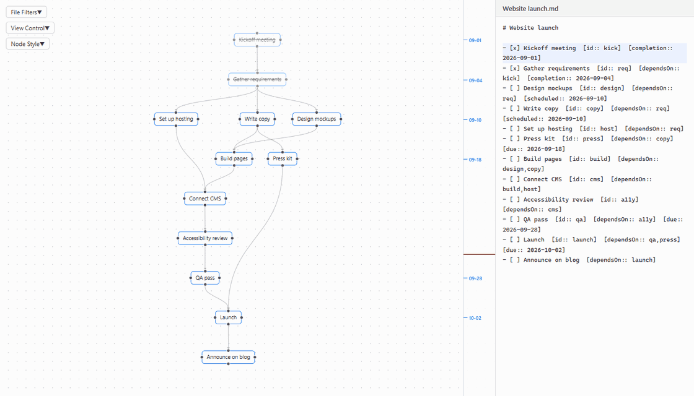
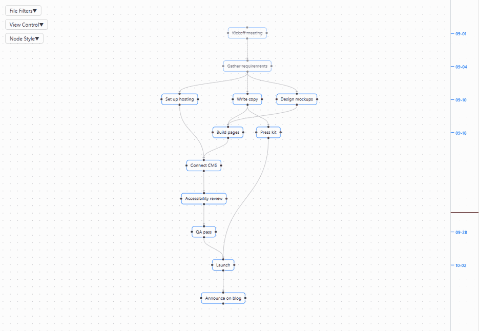
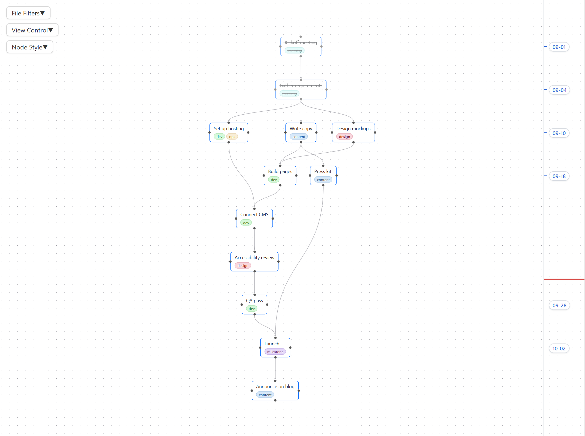

# Tasks Flowchart

[](https://community.obsidian.md/plugins/task-flow)
[](https://community.obsidian.md/plugins/task-flow)
[](https://github.com/shenfan19/task-flow/releases/latest)
[](manifest.json)
[](LICENSE)

**Tasks Flowchart** is a plugin for [Obsidian](https://obsidian.md) that draws your [Tasks](https://github.com/obsidian-tasks-group/obsidian-tasks) as a flowchart. Follow the flow of work along dependency chains, see what blocks what, link and create tasks by dragging, and keep everything as plain Markdown.

[中文说明](README_zh.md)

**Drop a connection on empty canvas to create a linked task.** It is written into your note and opened with its name selected.



**Drag between two tasks to link them. Select an arrow and press Delete to unlink.**



**Turn on the time axis to order tasks by date.**



## Why Tasks Flowchart

- **Your plan stays plain Markdown.** Every node is a task line in your notes and every arrow is a field on that line. There is no database and no hidden file format, so the plan works in any editor, with git and sync, with Dataview and the Tasks plugin's own queries, and it is all still there if you uninstall Tasks Flowchart.
- **See what blocks what.** Upstream tasks come before the tasks that wait on them, and a task with nothing left above it is one you can start now.

Three lines like these become three connected nodes:

```markdown
- [ ] Write copy  [id:: copy]
- [ ] Design mockups  [id:: design]
- [ ] Build pages  [dependsOn:: design,copy]
```

## Getting started

1. Install and enable the [Tasks](https://github.com/obsidian-tasks-group/obsidian-tasks) plugin. Tasks Flowchart reads its Dataview-style fields `[id:: ]` and `[dependsOn:: ]`. The emoji format `🆔` and `⛔` is not supported yet.
2. Install Tasks Flowchart from **Settings → Community plugins → Browse**. To install manually, copy `main.js`, `manifest.json` and `styles.css` from the [latest release](https://github.com/shenfan19/task-flow/releases/latest) into `<your-vault>/.obsidian/plugins/task-flow/`.
3. Click **Open tasks flowchart** in the left ribbon, or run **Tasks Flowchart: Open flowchart**. Click **Layout** at the top left, then **Overview**.

All settings live in the cards on the left of the view, **Presets**, **View Control**, **File Filters** and **Node Style**, below the **Layout**, **Overview** and **Reset** buttons.

## Usage

- **Link**: drag from a node's downstream side, the bottom in a top to bottom layout, or from its left or right side onto another node. That node now depends on the first one. Drag from the upstream side instead to make the first node depend on the other. A missing `[id:: ]` is generated for you.
- **Unlink**: right-click an arrow and choose **Delete link**, or click it and press Delete or Backspace.
- **Create**: let go on empty canvas instead of on a node. A line `- [ ] untitled` is added below the original task and its subtasks, linked by the same rule, and opened in a side pane with `untitled` selected, so you can type the name right away. Further ones are numbered `untitled2`, `untitled3` and so on, one word each so a double-click selects the whole name, and the Tasks plugin's global filter tag is added if you use one.
- **Select**: click a node or an arrow to select it. Clicking empty canvas deselects.
- **Highlight**: right-click a node or an arrow and choose **Highlight** to mark it with a glowing outline, and **Remove highlight** to take the mark off. A highlighted node lights up alone, without its arrows. Marks stay while you click, drag and open tasks, and **Clear all highlights**, in the right-click menus including the one on empty canvas, removes them all. The color is **Highlight** in Node Style.
- **Focus**: right-click a node and choose **Focus chain** to keep its whole chain, every task it depends on and every task that depends on it, at full strength while the rest of the graph fades. Click empty canvas to clear the focus.
- **Reset**: the **Reset** button, or the **Tasks Flowchart: Reset, clear highlights and focus** command, removes every highlight and the focus at once. Highlights and focus are otherwise kept when the view is closed and opened again, and so are the node positions and where the canvas was panned and zoomed to.
- **Open**: double-click a node, or right-click it and choose **Open task**, to open its note in a side pane with the cursor at the end of the task's name, ready to type. A name still left as `untitled` is selected instead, so typing replaces it. **Click** and **Double-click** in View Control set what each does to a node, **Select**, **Focus chain** or **Open task**. By default a click selects and a double click opens. Right-click an arrow to open the task at either end.
- **Commands**: **Tasks Flowchart: Layout** and **Tasks Flowchart: Overview, fit the graph in the view** do the same as the two buttons and can be given hotkeys in **Settings → Hotkeys**.
- **Arrange**: drag nodes freely, and their positions are remembered. **Layout** arranges everything in the chosen direction with curved, straight or stepped arrows and keeps the zoom. The view stays where it is, or centers on the selected task if there is one. **Overview** fits the graph on screen. Both buttons sit at the top of the rail on the left.
- **Time axis**: each task is placed by one date: the done date of a finished task, otherwise its due date, then its scheduled date, then its start date. Tasks sharing a date line up, undated tasks fall between their neighbors, and the ruler marks each task's date and stretches with the tasks in between. A red line marks today, a red arrow marks a task dated before one it depends on, and dated nodes can only be dragged sideways.
- **Filter**: in **File Filters**, show only tasks with a dependency link, which is on by default, hide tasks containing keywords such as `archived on`, and filter by status, tag or folder. Filters are kept between sessions.
- **Presets**: pick a saved set of filters in **Presets** to load it. **Save** stores the current filters in the selected preset, and **New…** saves them as a new one. **Default** is always there.
- **Style**: in **Node Style**, set the border, highlight and text colors and the font size and background of every node, give high, medium and low priority tasks their own font size and background, render task text as Markdown, and show tags as chips with automatic colors.
- **Refresh**: the graph follows your edits. A few seconds after you change a task line and the note is saved, its node shows the new text in the same place. A changed date moves the node on the time axis at the next **Layout**. Tasks also reload every 30 seconds, or with **Refresh** in **View Control**, and refreshing waits while you drag.

## Troubleshooting

A task missing from the graph usually has no dependency link, and **Only show tasks with a relation** hides such tasks by default. Otherwise check the keyword, status, tag and folder filters, and check that the Tasks plugin indexes the line, which requires the Tasks global filter tag if you set one.

Tasks Flowchart reads `[id:: ]`, `[dependsOn:: ]` and date fields anywhere on the line, so links survive text that archiving plugins append after them. The Tasks plugin only reads fields at the end of a line, so its own queries see no id, dependencies or dates on such a task.

## Data

Dependencies live only in your notes. Node positions, the pan and zoom of the canvas, filters, presets, view settings, highlights and focus are saved in `.obsidian/plugins/task-flow/data.json`. Deleting that file resets the layout and settings without touching any task.

## Your notes

Tasks Flowchart edits your notes directly. Linking two tasks adds an `[id:: ]` field to one task line and a `[dependsOn:: ]` field to the other, unlinking removes that entry from `[dependsOn:: ]`, and dropping a connection on empty canvas inserts a new `- [ ] untitled` line below the task it started from. It changes only the task lines involved and leaves the rest of the note as it is. There is no undo inside the flowchart: Obsidian's own undo works while the note is open in an editor, and the core File recovery plugin keeps snapshots you can go back to. Keep your vault backed up or under version control, such as git or Obsidian Sync version history, before using it on notes that matter.

The plugin is provided as is, without warranty of any kind, as set out in the [MIT license](LICENSE).

## Development

The project requires Node.js 22 or later. `npm install` and `npm run build` write `main.js`, `manifest.json` and `styles.css` to `dist/`. Releases are built and published by GitHub Actions from a version tag, and the steps are described at the top of `.github/workflows/release.yml`.

## Acknowledgments

This project was developed with AI coding assistance for code generation, automated testing, and documentation.

## License

MIT, see [LICENSE](LICENSE).
