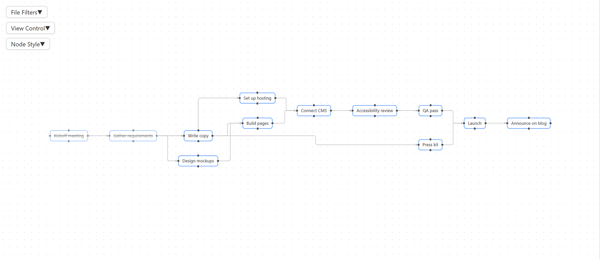

# Task Flow

**Task Flow 把 [Tasks 插件](https://github.com/obsidian-tasks-group/obsidian-tasks) 里的任务依赖关系画成一张可交互的节点图**，让你一眼看清任务之间的依赖链、卡在哪里、现在能立刻动手做什么，不用在一长串扁平的勾选列表里翻找。

[English](README.md)


图上的每一条箭头都来自笔记里真实存在的 `[id:: ]` 和 `[dependsOn:: ]` 字段，在画布上做的每一处修改也都写回这些笔记，不需要另外维护一张图。

## 计划始终是明文 Markdown

能拖拽方框做项目规划的工具不少，但大多数把结果存在自己的数据库里，或者存成只有它自己读得懂的文件格式。Task Flow 不这样做。每个节点就是某篇笔记里的一行任务，每条箭头就是这行任务上的一个短字段：

```markdown
- [ ] Design mockups  [id:: design]
- [ ] Build pages  [dependsOn:: design]
```

画箭头、删箭头、拖出新任务，Task Flow 改动的都只是这些文本行。因此：

- 整个计划在任何文本编辑器、任何设备上都能直接阅读和修改，装不装这个插件都一样；
- 计划和其他笔记一样，可以放进 git、同步服务和备份；
- Tasks 插件、Dataview 以及你自己写的查询，看到的都是同一套依赖关系；
- 哪天卸载了 Task Flow，所有任务和依赖仍然以明文留在笔记里。

Task Flow 存在笔记之外的，只有图谱在屏幕上的样子，比如节点位置和过滤预设，详见[数据存放位置](#数据存放位置)。

## 为什么需要 Task Flow

扁平的任务列表看不出一件事为什么卡住。一个项目里互相阻塞的任务一多，翻勾选列表就回答不了真正要紧的两个问题：

- 谁在卡着谁？
- 现在哪些任务可以放心开始？

Task Flow 一眼就能回答这两个问题。上游任务排在等待它的任务前面，工作链沿同一个方向读下去，上面已经没有未完成前置的任务就是可以动手的任务。

## 功能

- **全程明文 Markdown**：节点和箭头都来自笔记里 Tasks 插件的 `id` 和 `dependsOn` 字段，画布上的每一次编辑都是对这些文本行的编辑，没有数据库，也没有隐藏的文件格式。
- **在画布上编辑依赖**：从一个节点拖到另一个节点就新增一条依赖，选中箭头按 Delete 就删除，改动直接写进笔记里的任务行。
- **拖出空白处新建任务**：把连线拖到画布空白处松开，Task Flow 会新建一个空白的 `new task`，与出发节点建立依赖，写进同一篇笔记，并在右侧分栏打开、选中名字，直接输入即可改名。
- **时间轴**：按日期排布整张图，同一天的任务对齐，视图边缘的标尺标出各任务的日期，并随中间任务的多少伸缩。
- **点节点打开笔记**：在右侧分栏打开任务所在的笔记，并定位到任务那一行。
- **四个方向的自动排布**：从上到下、从下到上、从左到右、从右到左，箭头可选曲线、直线或阶梯线。
- **文件过滤和保存预设**：只看某些文件夹或排除某些文件夹，选择显示未完成还是已完成的任务，每一组过滤条件都能存成命名预设。
- **节点样式**：自定义颜色和字号，可以把任务文字按 Markdown 渲染，也可以按优先级给节点变色变大。
- **自动刷新和自动排布**：各有独立的开关和间隔，在别处改了任务，图谱也能跟上。

## 前置条件

- 装好并启用 [Tasks](https://github.com/obsidian-tasks-group/obsidian-tasks) 这个社区插件。
- 任务之间用 Tasks 插件的 Dataview 风格字段互相引用，即 `[id:: <id>]` 和 `[dependsOn:: <id1>,<id2>]`。Task Flow 只读写这一种格式，Tasks 插件的 emoji 格式 `🆔` 和 `⛔` 暂不支持。

下面这三行会在 Task Flow 里画成三个相连的节点：

```markdown
- [ ] Write copy  [id:: copy]
- [ ] Design mockups  [id:: design]
- [ ] Build pages  [dependsOn:: design,copy]
```

## 安装

在进入 Obsidian 官方插件市场之前，先手动安装：

1. 从 [最新 Release](https://github.com/shenfan19/task-flow/releases) 下载 `main.js`、`manifest.json`、`styles.css`。
2. 拷贝到 `<你的vault>/.obsidian/plugins/task-flow/`。
3. 重启 Obsidian，在 设置 → 第三方插件 里启用 **Task Flow**。

## 快速上手

1. 点击左侧功能区的 Task Flow 图标，或者在命令面板里运行 **Task Flow: Open Task Flow view**，图谱会在新标签页里打开。
2. 展开左侧的 **View Control**，点 **Layout** 自动排布节点，再点 **Overview** 让整张图显示在屏幕内。
3. 用 **File Filters** 把范围缩小到你正在做的项目。

所有设置都在视图左侧的三个面板里，分别是 **File Filters**、**View Control** 和 **Node Style**，没有单独的设置页。

## 使用说明

### 怎么读这张图

每个节点是一个任务，每条箭头从一个任务指向依赖它的任务。已完成的任务显示为淡色并带删除线。图的走向就是你选的排布方向，默认从上到下时，要先做的工作在上面。

默认只显示至少有一条依赖关系的任务，因为一个 vault 里往往有成千上万个互不相关的勾选项。在 **File Filters** 里关掉 **Only show tasks with a relation** 就能看到所有任务。

### 移动和缩放

- 拖动画布空白处平移，滚轮缩放。
- 拖动节点可以移动它。每个节点的位置都会记住，关掉 Obsidian 再打开也还在。
- **Overview** 把整张图缩放到屏幕内，不移动任何节点。
- **Layout** 重新排布所有节点。勾上旁边的 **every** 会按设定的秒数定时自动排布，图能一直保持整齐，但手动摆好的位置会被覆盖。

### 打开任务

点击节点，它所在的笔记会在右侧分栏打开，并滚动到任务那一行。之后的点击都复用这个分栏，你也可以像其他 Obsidian 标签页一样把它拖到工作区的任何位置。

### 添加和删除依赖

每个节点四条边上各有一个连接点，从连接点拖到另一个节点上就建立依赖。

- 从节点 A 的下游一侧拖到节点 B，从上到下排布时下游一侧就是底边，从 A 的左右两侧拖出也一样，表示 B 依赖 A，箭头从 A 指向 B。
- 从节点 A 的上游一侧拖到节点 B，从上到下排布时上游一侧就是顶边，表示 A 依赖 B，箭头指回 A。

Task Flow 把依赖写成被依赖方所在任务行里的 `[dependsOn:: ]` 字段。另一个任务如果还没有 `[id:: ]`，会自动生成一个随机短 id 加上去。

要删除依赖，点击箭头选中它，按 Delete 或 Backspace，笔记里 `[dependsOn:: ]` 字段中对应的 id 会被删掉。


### 拖出空白处新建任务

从连接点拖出，不落在其他节点上，而是在画布空白处松开，Task Flow 会依次：

1. 在同一篇笔记里新增一行 `- [ ] new task`，位置紧跟在出发任务和它的子任务后面，缩进与出发任务相同；
2. 按照和已有节点相同的规则建立依赖，从下游一侧或左右两侧拖出，新任务依赖原任务，从上游一侧拖出，原任务依赖新任务，箭头指回原节点；
3. 把新节点放在松开鼠标的位置；
4. 在右侧分栏打开这篇笔记，并选中 `new task` 这几个字，直接输入就能替换成真正的名字。

笔记里已经有 `new task` 时，下一个会叫 `new task 2`，再下一个叫 `new task 3`，以此类推。Tasks 插件如果设置了全局过滤标签，比如 `#task`，新行会自动带上它，保证 Tasks 插件能识别。拖动距离很短时按点击处理，不会新建任务。


### 时间轴

在 **View Control** 里勾上 **Time axis**，图谱就按日期排布。已完成的任务按完成日期放，未完成的按计划日期放，没有计划日期再按截止日期放。三个日期都没有的任务只按依赖关系放。

- 日期相同的任务排在同一高度，从左到右排布时排在同一列。
- 日期较晚的任务总是排在日期较早的任务后面。
- 任务排在它依赖的所有任务后面，除非两者的日期顺序相反。两个带日期的任务之间夹着几个没有日期的任务时，这些任务在两者之间依次排开。
- 视图边缘的标尺只标出图上任务实际带有的日期，保持清爽。标尺是弹性的，两个日期之间的距离取决于中间夹着多少任务，与相隔天数无关。红线表示今天。日期跨年时，每个标签都会带上年份。
- 如果依赖方的日期早于被依赖的任务，这条箭头画成红色，计划和依赖关系自相矛盾的地方一眼就能看到。
- 有日期的节点只能横向拖动，因为它在轴上的位置就是它的日期。没有日期的节点可以随意拖动。

图上一个带日期的任务都没有时，节点按依赖关系排布，标尺上只有今天那条红线。

时间轴排布在点 **Layout** 时生效，开启自动排布时每次自动排布也会生效。



### 过滤

**File Filters** 决定哪些任务出现在图上。

- **Only show tasks with a relation**：隐藏两个方向上都没有依赖关系的任务，默认开启。
- **Status**：显示未完成任务、已完成任务或两者都显示，已取消的任务算作已完成。
- **Directory Path**：在目录树里勾选文件夹，选 **Include checked** 只显示这些文件夹里的任务，选 **Exclude checked** 显示除这些文件夹以外的所有任务。
- **Presets**：输入名字后点 **Save** 保存当前的过滤条件，之后从列表里选中预设即可切换回去，**Delete** 删除选中的预设。

### 节点样式

**Node Style** 控制所有节点的外观。

- **Background**、**Border**、**Text Color**：设置节点的背景色、边框色和文字颜色。
- **Font Size**：以像素为单位设置字号。
- **Rich text**：把任务文字按 Markdown 渲染，链接、标签和格式与笔记里的显示一致。默认关闭，因为大图上渲染会比较慢。
- **Color/size by priority**：在 Tasks 插件里设置了优先级的任务使用各自的边框颜色，节点也相应变大或变小，最高优先级为红色、最大，最低优先级为灰色、最小。普通优先级的任务保持上面设置的颜色。

### 保持同步

Task Flow 从 Tasks 插件读取任务。点 **View Control** 里的 **Refresh** 重新读取，或者勾上旁边的 **every** 按设定间隔自动读取，默认 30 秒一次。刷新只更新任务和箭头，已经在图上的节点不会被挪动。

## 数据存放位置

任务之间的依赖只存在笔记里，形式就是 `[id:: ]` 和 `[dependsOn:: ]` 字段。节点位置、过滤预设和视图设置保存在 vault 里的 `.obsidian/plugins/task-flow/data.json`。删掉这个文件会重置布局和设置，不会影响任何任务。

## 许可证

MIT，见 [LICENSE](LICENSE)。
