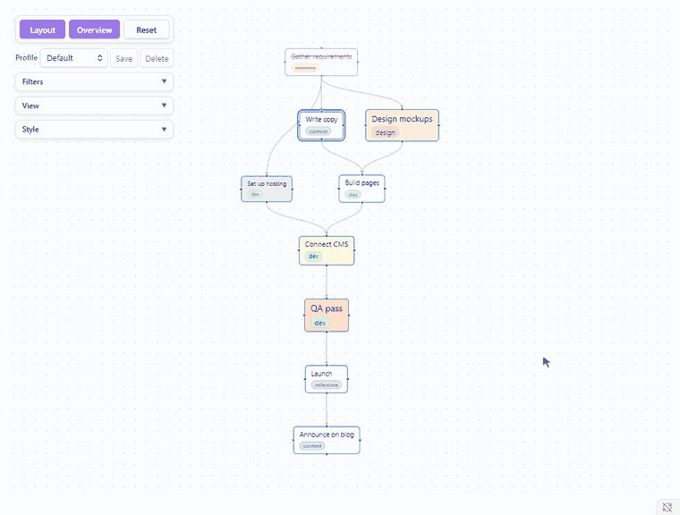

# Filters, profiles and style

## Filters

In the **Filters** card, choose which tasks the graph shows. The settings are kept between sessions.

- Only show tasks with a relation: on by default, it hides tasks that have no dependency link.
- Keywords: separated by commas and matched in the task text and tags, in any case, such as `archived on`. They are not matched in fields such as `[id:: ]` or `[dependsOn:: ]`.
- Tags, priority and folders: tick the ones you want, then choose **Include** to show only those tasks or **Exclude** to hide them.
- Status: at the end of the panel, with the relation switch.

With **Include** and keywords, a task is shown if its text or tags contain any of them.

## Profiles

A profile keeps the Filters, View and Style together. Pick one in the **Profile** row to switch all three at once.

- Save: stores the current settings in the selected profile.
- New…: saves them as a new profile.
- Star: a `*` after the name means the settings changed since the last save.
- Default: always there and cannot be deleted.

Switching to a profile with another layout direction, link type, date axis or lane setting lays the graph out again. Node positions, the pan and zoom, highlights and focus belong to the view, not to a profile, so all profiles share them.

## Style

In the **Style** card, you can set:

- Colors: the border, highlight and text colors.
- Nodes: the font size and background of every node, and a font size and background of their own for the tasks of each priority from Highest to Lowest.
- Links: drag **Line width** and **Arrow size** to size them.
- Text: render task text as Markdown, and show tags as chips with automatic colors.
- Link counts: turn on **Show link counts**. Each node then shows `depend N`, the number of tasks it depends on, where its arrows come in, and `next N`, the number of tasks that depend on it, where they go out. Every link is counted, whether or not the filters show the task at its other end. It is off by default.

Back to the [manual](index.md).
